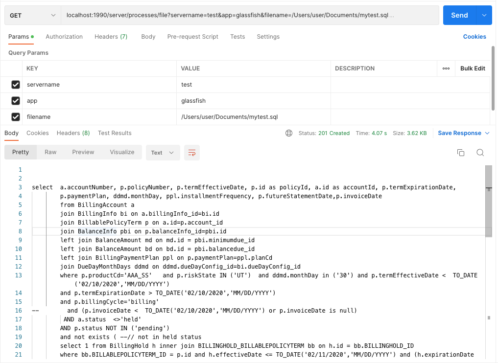
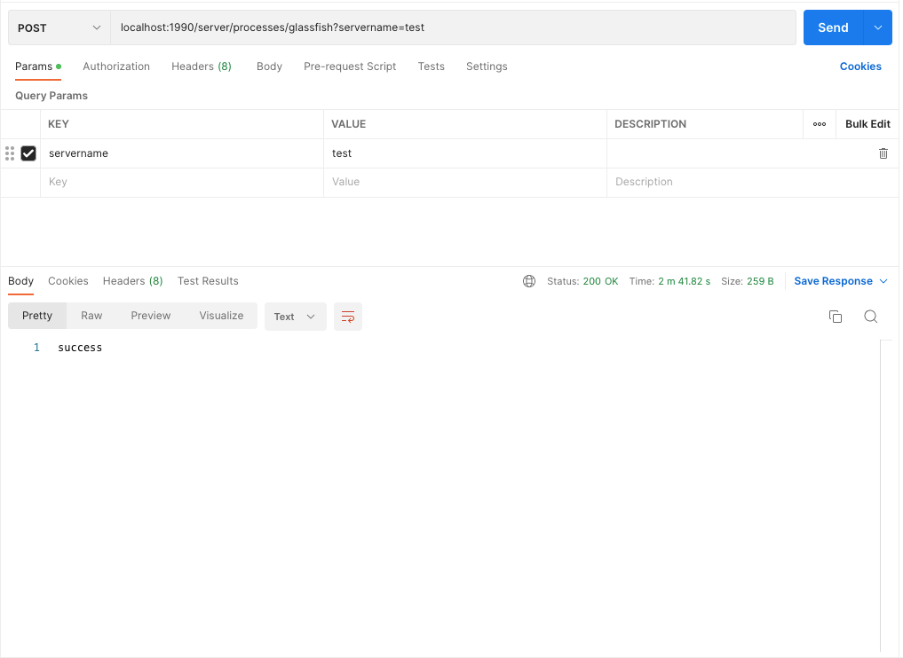

 

  

<h3 align="center"> Linux GlassFish Spring Batch Processes
</h3>

  

    A walkthrough to the project set up

  

<!-- TABLE OF CONTENTS -->

  
Table of Contents

  <ol>
    <li>
      <a href="#about-the-project">About The Project</a>
      <ul>
        <li><a href="#built-with">Tech Stack</a></li>
      </ul>
    </li>
    <li>
      <a href="#getting-started">Getting Started</a>
    </li>
    
  </ol>

<!-- ABOUT THE PROJECT -->
## About The Project

    

This project is a little spring utility for remote glassfish server that allows developer to read logs file or any other remote file without having to ssh in the sever. The generated jar can be executed as jar and started as a service <a href=" https://www.baeldung.com/linux/run-java-application-as-service">Java as Service</a></li>

Here's why:
* Unable to determine why the server hung or find out the exceptions thrown
* Restart the glassfish server remotely in one click using any rest tool or browser for get

(<a href="#top">back to top</a>)

### Built With

This section should list any major frameworks/libraries used to in our project.

* Java Spring
* Batch
* Linux
* Glassfish

(<a href="#top">back to top</a>)

<!-- GETTING STARTED -->
## Getting Started

Here's are instructions on setting up your project locally.

* Java 1.8 or higher
* Download the glassfish
  <a href="https://javaee.github.io/glassfish/download">4.1.2</a> and unzip it in a folder in your computer in my local it is in /Users/user/Documents/WebServers/glassfish4
* Import the project in your IDE (strongly recommend IntelliJ)

How to run it.

* Import or open the pom.xml as project
* Run the project
* <a href="#">mvn clean package</a> (To generate the jar file)
  * To read a specific file/log file (GET)
  <a href="#">localhost:1990/server/processes/file?servername=test&app=glassfish&filename=/Users/user/Documents/mytest.sql</a>
    * To read restart the server (POST)
  <a href="#">localhost:1990/server/processes/glassfish?servername=test</a>
       
  

    

